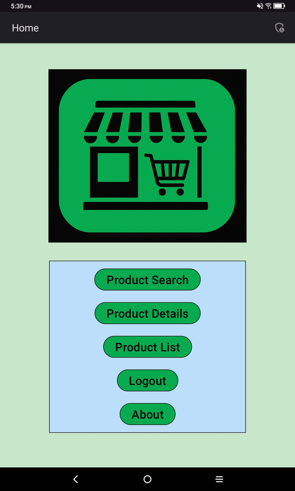
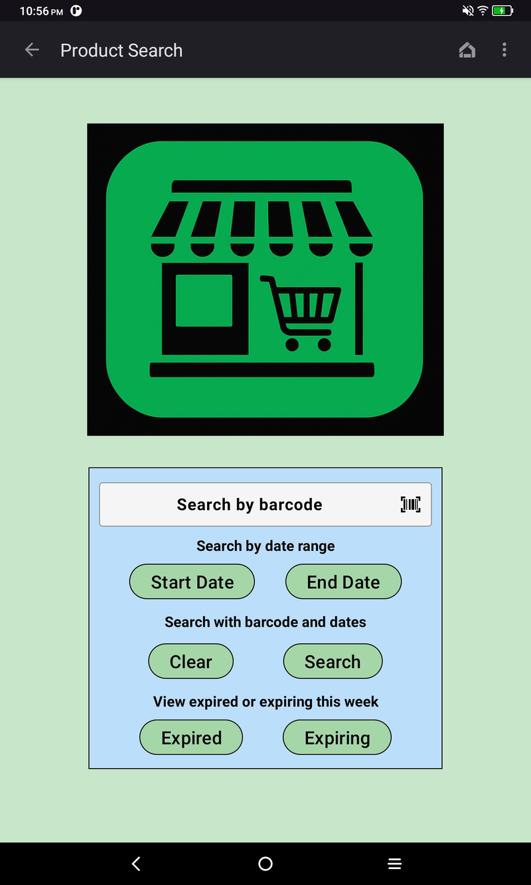
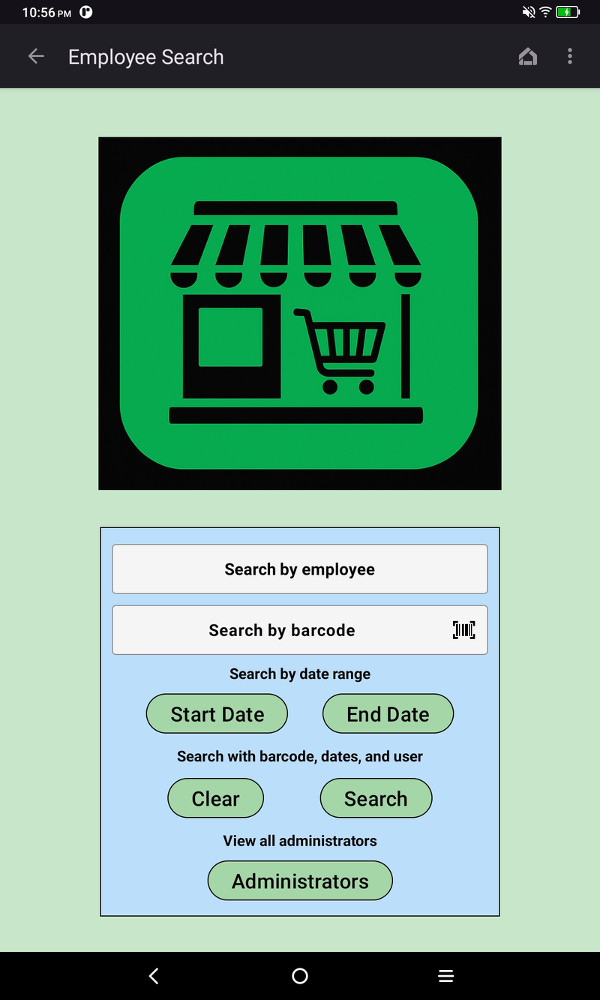
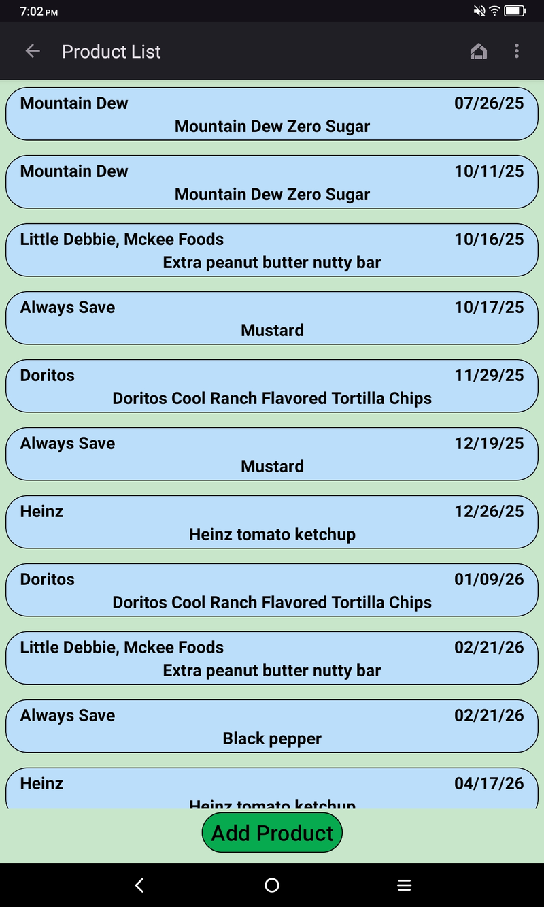
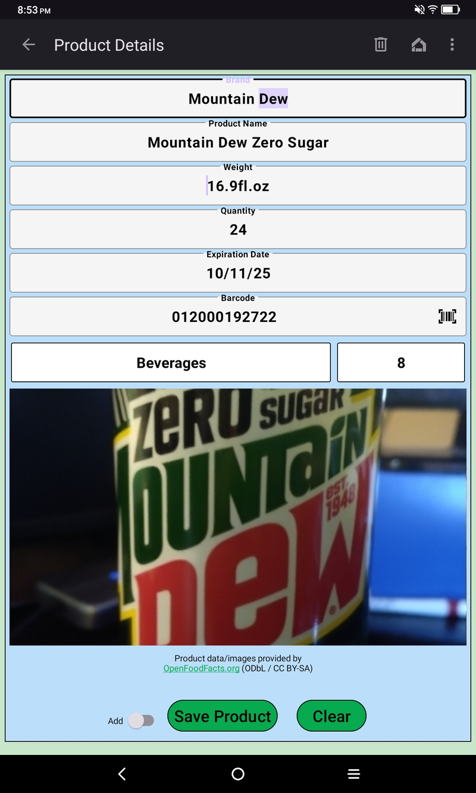
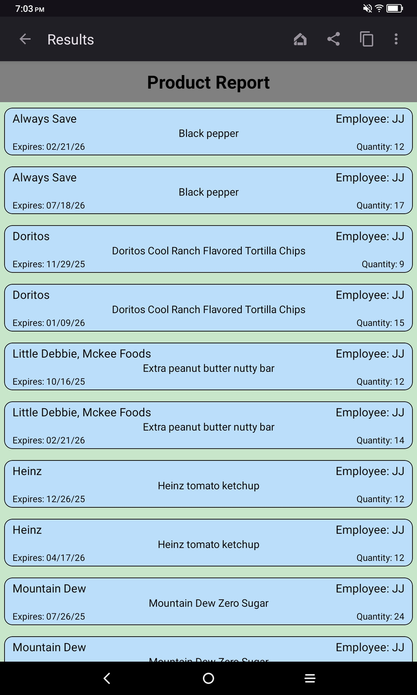

# Best By Manager

**Best By Manager** is an Android inventory-tracking app built to help small grocery stores, gas stations, and small businesses stay on top of product expiration dates. With barcode lookup, image support, and smart reporting, it ensures food is safe to consume and helps reduce waste by keeping your stock fresh.

## Status
📦 **Repo build version:** 1.2.5 (versionCode 17).
🚀 **Android app in closed beta on Google Play**

## Table of Contents

[Features](#features)

[Preview](#preview)

[Admin Setup](#admin-setup)

[Usage Notes](#usage-notes)

[Account Recovery (Local-Only)](#account-recovery-local-only)

[Installation](#installation)

[Quick Start Guide](#quick-start-guide)

[Build From Source](#build-from-source)

[Requirements](#requirements)

[Permissions](#permissions)

[Tech Stack & Architecture](https://github.com/Jwonka/BestByManager#techstackarchitecture)

[Attribution](#attribution)

[Testing Status](#testing-status)

[Known Issues](#known-issues)

[Migrations](#migrations)

[Privacy](#privacy)

[License](#license)

[Contributing](#contributing)

## Features
- 📦 **Inventory tracking** for all food products with brand, barcode, category, quantity, and expiration date
- 📷 **Photo capture** for each product (camera capture + thumbnail storage) 
- 🔎 **Barcode scanning** with 1D barcode support and Open Food Facts lookup 
- 📅 **Reports** by date range, barcode, and employee, including discarded quantities
- 🧾 **User-level reporting** with grouped totals
- 📤 **Share** inventory summaries (text sharing)
- 🔔 **Early warning reminders** (7‑day pre‑expiry alerts) via bell toggle on expiration date
- 🗃️ **Offline storage** using Room database 
- 🔐 **Admin mode**: First employee account becomes administrator
- 🛒 Built for small grocery stores, gas stations, or stockrooms 

## Preview

  <h3>🏠 Home Screen &nbsp;&nbsp;&nbsp;&nbsp;&nbsp;&nbsp;&nbsp;&nbsp;&nbsp;&nbsp;&nbsp;&nbsp;&nbsp;&nbsp;&nbsp;&nbsp;&nbsp; 🔍 Product Search</h3>
  
  

  <h3>👤 Employee Search &nbsp;&nbsp;&nbsp;&nbsp;&nbsp;&nbsp;&nbsp;&nbsp;&nbsp;&nbsp;&nbsp;&nbsp;&nbsp;&nbsp;&nbsp;&nbsp; 📦 Product List</h3>
  
  

  <h3>📋 Product Details &nbsp;&nbsp;&nbsp;&nbsp;&nbsp;&nbsp;&nbsp;&nbsp;&nbsp;&nbsp;&nbsp;&nbsp;&nbsp;&nbsp;&nbsp;&nbsp;&nbsp;&nbsp; 📈 Product Report</h3>
  
  

## Admin Setup
🧑‍💼 The first account created after installation is automatically granted **administrator** privileges.

👥 Admins can add or edit users through the **Employee Details** screen.

🔐 Admins have additional privileges to:

- Add additional administrators
  
- Reset passwords for users

- View **User-Level Reports** (grouped product activity by each employee)
  
- Perform a full local data wipe (administrators only)

## Usage Notes
🛒 To add products, tap **Add Product** or open **Product Details**. 

Required fields include brand, product name, weight, quantity, expiration date, barcode, and category.

- 🔔 **Early warning reminders**:
  - Tap the bell icon on the expiration field to enable a 7‑day reminder.
  - Reminders are scheduled when you save and are cleared if the quantity drops to 0.
- 🧹 **Discard tracking**:
  - When discarding expired or damaged items, the app logs a discard note (optional reason) and updates reports with discarded totals.
- 🔄 **Product Details**:
  - This is where you can update an existing product or add a **new expiration date** using the toggle next to **Save Product**.
  
📋 All users can access **Product Reports** from the **Product Search** screen to view product data filtered by:

- Barcode

- Date range

- Expiration status (e.g., expired, expiring soon)

### Account Recovery (Local-Only)

Best By Manager does not use cloud accounts, email, or external recovery services.

Password recovery options are intentionally **local and permission-based**:

- 🔐 **Administrator password reset**
  - Administrators can reset passwords for other users from the Employee Details screen.
  - This does **not** delete inventory or app data.

- 🔑 **Biometric-assisted self-reset (optional)**
  - If biometric authentication (PIN, pattern, fingerprint, or face) is enabled on the device,
    a employee may reset their own password after successful device authentication.
  - No data is deleted during this process.

- 🧹 **Administrator data wipe**
  - Administrators may perform a full local data wipe to return the app to first-run state.
  - This permanently deletes all users and inventory data on the device and cannot be undone.
  - Intended only for lost credentials or device handoff scenarios.

All data remains stored locally on the device at all times.

## Installation

### Google Play (Closed Beta)
Best By Manager is currently in closed beta testing on Google Play.
Public availability will follow after testing and review of feedback.

### APK Sideload
- 👉 [Download on itch.io](https://jwonka2.itch.io/best-by-manager)

**SHA256 checksum:** `bestbymanager-v1.2.5.apk`  
**Size:** ~9.59MB
- For **manual install (sideload)**: download the APK.  
- For **Google Play**: the AAB is provided for Play Console upload.

Android will prompt once to "Allow installs from unknown sources." Accept to complete the installation.

## Quick Start Guide
1. On your Android device,  👉 [Download / Donate on itch.io](https://jwonka2.itch.io/best-by-manager).
2. When prompted, allow your browser to install unknown apps **(one‑time toggle).**
3. Tap the downloaded file to install.
4. Launch **Best By Manager** from your app drawer.
5. Create the first account → You are now the administrator.

## Build From Source
Clone the repo
- git clone [https://github.com/Jwonka/BestByManager/tree/main](https://github.com/Jwonka/BestByManager/tree/main)
- cd BestByManager

Built with Android Studio Meerkat 2024.3.2
OR from the command line
./gradlew assembleRelease

## Requirements
-  API 27+(minSdk 27) (Android 8.1 Oreo) ~ API 35(targetSdk) (Android 15, Vanilla Ice Cream) ~ compileSdk 36
- Architecture ~ arm64‑v8a, armeabi‑v7a, x86_64

## Permissions
- 📷 `CAMERA` – required to take product photos and scan barcodes
- 🌐 `INTERNET` – required for Open Food Facts lookup
- 🔔 `POST_NOTIFICATIONS` – required for expiration/early warning alerts on Android 13+
- 🔐 `USE_BIOMETRIC` – optional biometric/PIN authentication for secure password reset

Note: Best By Manager does not request location, contacts, or any sensitive personal permissions. All data stays local to the device.

## Tech Stack & Architecture
- Language:  (Android Desugaring) 

- UI: Jetpack ConstraintLayout, Material 3

- Architecture pattern: MVVM (ViewModel + LiveData)

- Persistence: Room

- Build: Gradle 8, Android Plugin = 8.x

## Attribution
This app uses data and product images from [Open Food Facts](https://openfoodfacts.org), a free and open database of food products created by a non-profit community of volunteers.

- Product data is © Open Food Facts contributors and available under the [Open Database License (ODbL)](https://opendatacommons.org/licenses/odbl/1-0/).
- Product images are licensed under [Creative Commons Attribution–ShareAlike (CC BY–SA 3.0)](https://creativecommons.org/licenses/by-sa/3.0/).

## Testing Status
🧪 All screens have been manually tested for scrollability, responsiveness, and crash-free usage on common Android phones and tablets.

- Accessibility features (e.g., TalkBack) not yet verified.

## Known Issues
- Some screens may not scroll optimally on very small devices (< 5").
- No automated testing suite (yet).
- Cloud sync is not implemented, but may be added in a future version.
- Product deletion is permanent (no undo).
- Password recovery depends on administrator access or device biometric authentication.

## Migrations
Current Room schema version: **20**.  
Defined migrations: **15→16**, **16→17**, **17→18**, **18→19** (adds `earlyWarningEnabled` for reminders), **19→20** (adds `password reset` for admin).

## Privacy
Best By Manager stores all data locally on your device. No personal or product data is ever uploaded to external servers.

- 📷 The camera is only used to take product photos for local inventory tracking.
- 🌐 The app fetches public product information from [Open Food Facts](https://openfoodfacts.org) using barcode lookup.
- 🔒 No data is sent back to Open Food Facts or any third party.
- 🚫 There is no analytics, tracking, or cloud sync.
  
Because all data is stored locally, account recovery is handled via an optional full local reset rather than cloud-based password recovery.
This ensures your inventory stays private and under your control at all times.

## License
This project is licensed under the MIT  – see the [LICENSE](https://github.com/Jwonka/BestByManager/blob/main/LICENSE) file for details. 
You are free to use, modify, and distribute this application commercially or privately under the terms of the MIT License.

## Contributing
This project is currently not accepting outside contributions.  However, feel free to fork the repository, open issues, or suggest improvements. Bug reports are always welcome!

> ⚡ Built in Wisconsin with 💚 for small businesses.

