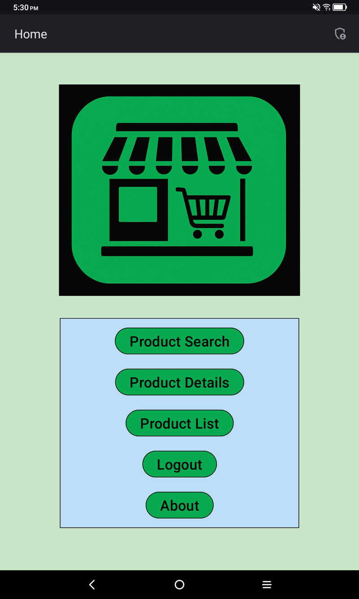
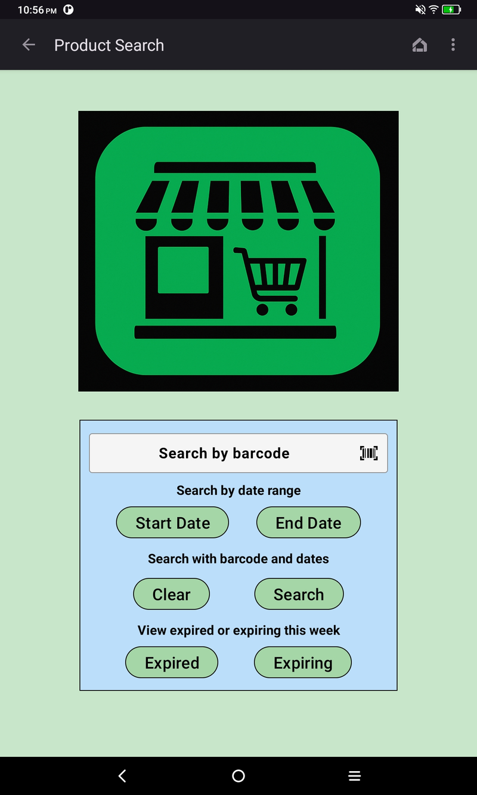
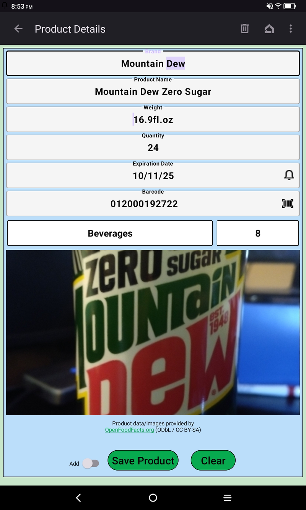
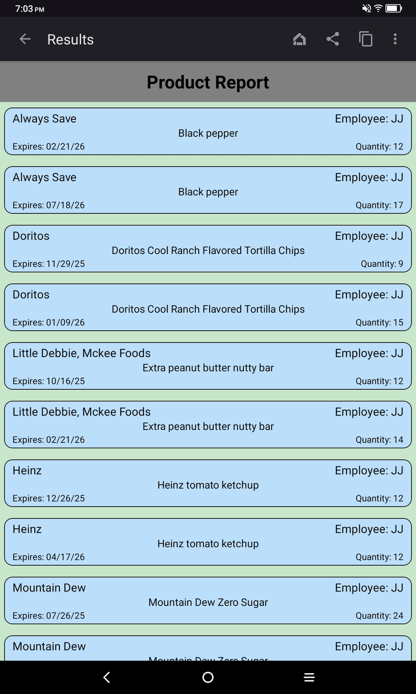

# Best By Manager


**Best By Manager** is a local-first Android inventory tracking app built for small grocery stores, gas stations, and stockrooms. It helps businesses stay on top of product expiration dates using barcode scanning, photo capture, smart reporting, and per-employee access control — all stored locally on the device with no cloud dependency.

> ⚠️ **This is not a traditional login app.**
> Best By Manager uses a **kiosk + employee session model**. The device stays in the store. An admin unlocks it, an employee selects themselves and enters a PIN, and all actions are tracked under that employee. Sessions expire automatically via idle lock.

---

## Status

📦 **Version:** 2.0.2
🚀 **Available on [Google Play](https://play.google.com/store/apps/details?id=com.bestbymanager.app)**

---

## Table of Contents

- [Features](#features)
- [How It Works — Kiosk Model](#how-it-works--kiosk-model)
- [Roles and Permissions](#roles-and-permissions)
- [Daily Operations](#daily-operations)
- [Product Form — Fields and Toggles](#product-form--fields-and-toggles)
- [Employee and Admin Management](#employee-and-admin-management)
- [Password Reset and PIN Reset](#password-reset-and-pin-reset)
- [Reports](#reports)
- [Admin Dashboard Toggles](#admin-dashboard-toggles)
- [Account Recovery](#account-recovery)
- [What Changed from v1.x](#what-changed-from-v1x)
- [Preview](#preview)
- [Installation](#installation)
- [Quick Start Guide](#quick-start-guide)
- [Build From Source](#build-from-source)
- [Requirements](#requirements)
- [Permissions](#permissions)
- [Tech Stack and Architecture](#tech-stack-and-architecture)
- [Attribution](#attribution)
- [Known Issues](#known-issues)
- [Migrations](#migrations)
- [Privacy](#privacy)
- [License](#license)
- [Contributing](#contributing)

---

## Features

- 📦 **Inventory tracking** — brand, barcode, category, aisle, quantity, weight, and expiration date
- 📷 **Photo capture** — take a product photo on save; replace it at any time from the overflow menu
- 🔎 **Barcode scanning** — 1D barcode support with Open Food Facts auto-fill lookup
- 🔔 **Expiration alerts** — on-device alarm fires on the expiration date
- 🔔 **Early warning reminders** — optional 7-day pre-expiry bell toggle per product
- 🗑️ **Discard tracking** — log discarded quantities with optional reason; reflected in reports
- 📅 **Reports** — filter by date range, barcode, employee, or expiration status; share or copy
- 🔐 **Kiosk access control** — employees select themselves and enter a PIN to unlock the app
- 👤 **Three-tier role model** — Owner, Administrator, Standard Employee
- 🌙 **Dark / light theme** — owner-controlled toggle
- 📴 **Offline mode** — disable Open Food Facts lookup for environments without reliable internet
- ⏱️ **Auto-lock** — configurable idle timeout returns the device to the employee selection screen
- 🗃️ **100% local storage** — Room database, no cloud sync, no analytics, no external accounts

---

## How It Works — Kiosk Model

Best By Manager operates as a shared-device kiosk. One device stays in the store and multiple employees use it throughout the day without a traditional login session.

**Typical daily flow:**
1. Admin or owner unlocks the device from the admin dashboard
2. An employee taps their name on the employee selection screen
3. The employee enters their PIN to start a session
4. They add and manage products — all actions are tracked under their account
5. The app returns to the employee selection screen when idle timeout fires or the employee manually locks out

Admins unlock the kiosk using a **password**. Standard employees use a **PIN**. The first account created during setup becomes the **Owner**.

---

## Roles and Permissions

| Capability | Standard Employee | Administrator | Owner |
|------------|:-----------------:|:-------------:|:-----:|
| Add / edit products | ✅ | ✅ | ✅ |
| Discard products | ✅ | ✅ | ✅ |
| View product reports | ✅ | ✅ | ✅ |
| View employee reports | ❌ | ✅ | ✅ |
| Add / edit employees | ❌ | ✅ | ✅ |
| Reset employee password | ❌ | ✅ | ✅ |
| Reset employee PIN | ❌ | ✅ | ✅ |
| Promote / demote admin | ❌ | ❌ | ✅ |
| Transfer ownership | ❌ | ❌ | ✅ |
| App Theme toggle | ❌ | ❌ | ✅ |
| Offline mode toggle | ❌ | ❌ | ✅ |
| Lock after idle toggle | ❌ | ❌ | ✅ |
| Full data wipe | ❌ | ❌ | ✅ |

---

## Daily Operations

### Adding a product
1. Tap **Product Details** from the home screen or admin dashboard
2. Scan the barcode — the app attempts to auto-fill from Open Food Facts
3. Fill in any missing required fields (product name, brand, weight, quantity, expiration date, barcode, category)
4. Tap the camera preview to take a product photo (optional)
5. Tap the **bell icon** on the expiration field to enable a 7-day early warning reminder (optional)
6. Tap **Save Product**

### Updating an existing product
Scan the barcode or find the product via Product Search. The most recent matching record loads automatically. Edit the fields and tap **Save Product**.

### Adding a new expiration date for the same product
Load the existing product, enable the **Add New Expiration** toggle next to the Save button, set the new date and quantity, and tap **Add New Expiration**. This creates a new record without overwriting the existing one. Use this when new stock arrives with a different expiration date.

### Replacing a product photo
Open the product in Product Details. Tap the overflow menu (⋮) and select **Replace Photo**. The camera launches and the new photo replaces the previous one when saved.

### Discarding products
Open the product in Product Details. Tap the overflow menu (⋮) and select **Discard**. Enter the quantity being discarded and an optional reason. The on-hand quantity updates immediately and the discard is logged in reports.

---

## Product Form — Fields and Toggles

| Field / Control | Required | Description |
|-----------------|:--------:|-------------|
| Product Name | ✅ | Display name used in lists and reports |
| Brand | ✅ | Used in reports and search |
| Weight | ✅ | Free text — enter value and unit (e.g. "12 oz", "340g") |
| Quantity | ✅ | On-hand count. Cannot be increased on an expired product |
| Expiration Date | ✅ | Tap to open date picker |
| Bell icon | ❌ | Enables a 7-day early warning notification. Filled bell = enabled. Cleared when quantity hits 0 |
| Barcode | ✅ | Scan with camera icon or enter manually. Accepts UPC-A, EAN-13, EAN-8, UPC-E |
| Category | ✅ | Select from dropdown |
| Aisle | ❌ | Select from dropdown |
| Photo | ❌ | Tap image area to take photo. Use overflow → Replace Photo to change it |
| Add New Expiration toggle | — | ON = creates a new product record. OFF = updates the existing one |

---

## Employee and Admin Management

Accessed from **Administrator Dashboard → Employee Details** (admin or owner required).

- **Creating an employee** — enter the employee name and tap Save. A temporary password is generated and shown in a dialog for admin accounts. Non-admin employees receive no temp password dialog since they use PIN only.
- **Admin toggle** — visible to the owner only. Promotes or demotes an admin. The last remaining admin cannot be demoted.
- **Delete employee** — available in the overflow menu when an employee record is loaded. The owner cannot be deleted. The last admin cannot be deleted.
- **Reset Password** — available for admin accounts only. Generates a new temporary password that expires in 24 hours.
- **Reset PIN** — clears the employee's current PIN. They are prompted to create a new one the next time they select their name from the kiosk screen.

---

## Password Reset and PIN Reset

| Scenario | Who can help | Action |
|----------|-------------|--------|
| Employee forgot PIN | Any admin or owner | Employee Details → Reset PIN |
| Admin forgot password | Another admin or owner | Employee Details → Reset Password |
| No admins available | No one — use data wipe | Login screen overflow → Reset App Data |
| PIN locked (5 failed attempts) | Any admin or owner | Employee Details → Reset PIN — or wait 5 minutes |

**Reset App Data** is the last resort. It permanently deletes all employees and all inventory. It cannot be undone. Use only for locked-out devices or device handoff.

---

## Reports

**Product Reports** (available to all employees)
- Search by barcode
- Search by date range
- Expiring soon (next 7 days)
- Expired products
- Full inventory

**Employee Reports** (admins and owner only)
- All entries by all employees
- Entries by specific employee
- Entries filtered by barcode, date range, or both
- Combined filters (employee + barcode + date range)

Reports can be copied to clipboard or shared via text from the overflow menu on any report screen.

---

## Admin Dashboard Toggles

| Toggle | Who can change | What it does |
|--------|:-------------:|-------------|
| **Lock after idle** | Owner | Automatically returns the app to the employee selection screen after inactivity. Prevents an unattended device from staying unlocked. |
| **Offline mode** | Owner | Disables Open Food Facts barcode lookup. Scanning still works and populates the barcode field, but no auto-fill data is fetched. Use in environments without reliable internet. |
| **App Theme** | Owner | Switches between light and dark themes across the entire app. Applied immediately and persists across sessions. |

---

## Account Recovery

Best By Manager does not use cloud accounts, email recovery, or external services of any kind. All recovery is local and permission-based.

| Scenario | Recovery path |
|----------|--------------|
| Employee forgot PIN | Admin resets PIN from Employee Details |
| Admin forgot password | Another admin or owner resets password from Employee Details |
| Only admin is locked out | Login screen overflow → Reset App Data (data wipe) |
| Device is being handed off | Login screen overflow → Reset App Data (data wipe) |

---

## What Changed from v1.x

>⚠️ **v2.0.2 is not a drop-in upgrade from v1.x.** The schema has been reset to version 1 with no migration path. Upgrading from v1.x will wipe all existing inventory and employee data on the device. This is intentional — the session model, authentication flow, and database structure are fundamentally different.

| Area | v1.x | v2.0.2 |
|------|------|--------|
| Authentication | Username + password login | Kiosk PIN per employee; password for admins |
| Roles | Admin / Standard | Owner / Admin / Standard Employee |
| Session model | Persistent login | Per-employee kiosk sessions with idle lock |
| Product image | Capture on add only | Capture on add + Replace Photo from overflow |
| Expiration reminders | Implied automatic | Opt-in bell toggle per product |
| Offline mode | Always online | Owner-controlled toggle |
| Idle lock | Not present | Configurable auto-lock |
| Discard tracking | Basic | Quantity + reason + report integration |

---

## Preview

<div align="center">
  <h3>🏠 Home Screen &nbsp;&nbsp;&nbsp;&nbsp;&nbsp;&nbsp;&nbsp;&nbsp;&nbsp;&nbsp;&nbsp;&nbsp;&nbsp;&nbsp;&nbsp;&nbsp;&nbsp; 🔍 Product Search</h3>
  <a href="images/homeScreen.png">
    
  </a>
  <a href="images/productSearch.png">
    
  </a>
</div>

<div align="center">
  <h3>📋 Product Details &nbsp;&nbsp;&nbsp;&nbsp;&nbsp;&nbsp;&nbsp;&nbsp;&nbsp;&nbsp;&nbsp;&nbsp;&nbsp;&nbsp;&nbsp;&nbsp;&nbsp;&nbsp; 📈 Product Report</h3>
  <a href="images/productDetails.png">
    
  </a>
  <a href="images/productReport.png">
    
  </a>
</div>

---

## Installation

### Google Play
📲 [Download on Google Play](https://play.google.com/store/apps/details?id=com.bestbymanager.app)

### APK Sideload
👉 [Download on itch.io](https://jwonka2.itch.io/best-by-manager)

Android will prompt once to allow installs from unknown sources. Accept to complete installation.

---

## Quick Start Guide

1. Install from Google Play or itch.io
2. Launch **Best By Manager**
3. Create the first account — this account becomes the **Owner**
4. From the Administrator Dashboard, add employees via **Employee Details**
5. Employees tap their name on the kiosk screen and set a PIN on first use
6. Start adding products from **Product Details**

---

## Build From Source

```bash
git clone https://github.com/Jwonka/BestByManager.git
cd BestByManager
./gradlew assembleRelease
```

Built with Android Studio Meerkat 2024.3.2

---

## Requirements

- **Min SDK:** API 27 (Android 8.1 Oreo)
- **Target SDK:** API 35 (Android 15)
- **Compile SDK:** 36
- **Architecture:** arm64-v8a, armeabi-v7a, x86_64

---

## Permissions

| Permission | Purpose |
|------------|---------|
| `CAMERA` | Product photos and barcode scanning |
| `INTERNET` | Open Food Facts barcode lookup (optional via offline mode) |
| `POST_NOTIFICATIONS` | Expiration and early warning alerts (Android 13+) |
| `USE_BIOMETRIC` | Secure local password reset option |
| `SCHEDULE_EXACT_ALARM` | On-time expiration day notifications |

Best By Manager does not request location, contacts, microphone, or any sensitive personal permissions. All data stays on the device.

---

## Tech Stack and Architecture

| Layer | Technology |
|-------|-----------|
| Language | Java 11 (Android Desugaring) |
| UI | Jetpack ConstraintLayout, Material 3 |
| Architecture | MVVM — ViewModel + LiveData |
| Persistence | Room (SQLite) |
| Image loading | Glide |
| Barcode scanning | ZXing (JourneyApps) |
| Product lookup | Open Food Facts REST API via Retrofit |
| Notifications | AlarmManager + NotificationManager |
| Build | Gradle 8, Android Gradle Plugin 8.x |

---

## Attribution

Product data provided by [Open Food Facts](https://openfoodfacts.org), a free and open database maintained by a non-profit volunteer community.

- Product data © Open Food Facts contributors — [Open Database License (ODbL)](https://opendatacommons.org/licenses/odbl/1-0/)
- Product images — [Creative Commons Attribution–ShareAlike (CC BY-SA 3.0)](https://creativecommons.org/licenses/by-sa/3.0/)

---

## Known Issues

- Weight field is free text; a unit spinner (oz, g, lb, fl oz) is planned for v2.1
- Admin promote/demote and ownership transfer UI planned for v2.1
- No automated test suite
- Accessibility (TalkBack) not yet verified

---

## Migrations

Current Room schema version: **1**

The kiosk branch (v2.0.2) uses a clean schema with no defined migrations.
`fallbackToDestructiveMigration()` is enabled — on schema change the database
is wiped and rebuilt automatically. No migration path exists from the v1.x schema.

---

## Privacy

Best By Manager stores all data locally on your device. Nothing is ever uploaded to any server.

- Camera is used only for local product photos
- Barcode lookup fetches public product data from Open Food Facts — no user data is sent
- No analytics, no tracking, no cloud sync, no accounts on any external service
- All employee credentials are stored as bcrypt hashes on-device only

Full privacy policy: [https://jwonka.github.io/BestByManager/privacy.html](https://jwonka.github.io/BestByManager/privacy.html)

---

## License

MIT License — see [LICENSE](https://github.com/Jwonka/BestByManager/blob/main/LICENSE)

You are free to use, modify, and distribute this application commercially or privately under the terms of the MIT License.

---

## Contributing

Not currently accepting outside contributions. Feel free to fork, open issues, or suggest improvements. Bug reports are always welcome.

---

> ⚡ Built in Wisconsin with 💚 for small businesses.

